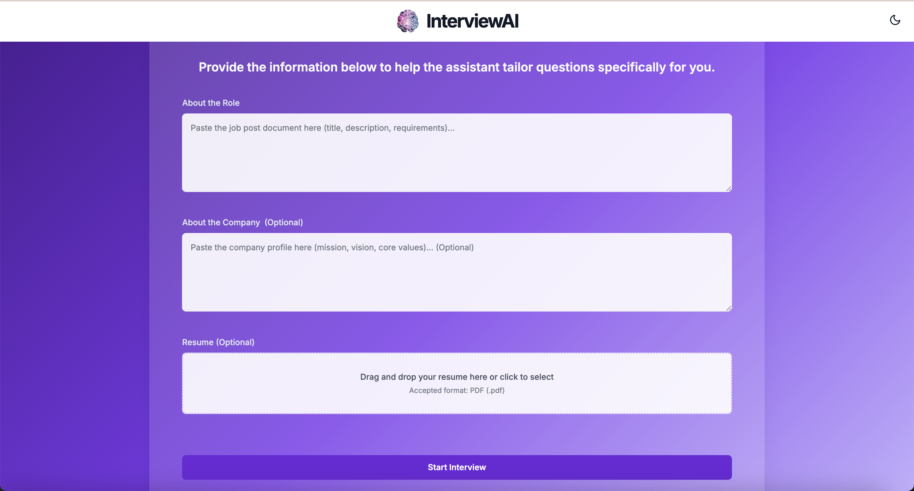
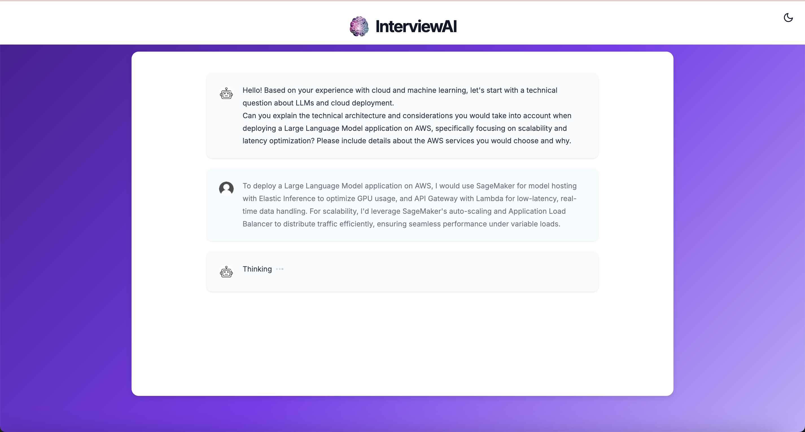

# AI Interview Assistant

A proof-of-concept AI-powered technical interview simulation platform that provides direct technical assessment through focused questions and real-time evaluation.

## Overview

The AI Interview Assistant is an innovative solution that provides a streamlined technical interview experience. The system focuses on direct technical assessment through focused questions, evaluating candidates' technical knowledge, problem-solving abilities, and implementation skills.



### Conversation Interface


## Key Features

### 1. Direct Technical Assessment
- Focused technical questions without preliminary background checks
- Immediate technical depth evaluation
- Contextual follow-up questions based on responses
- Dynamic technical difficulty adjustment
- Comprehensive technical skills assessment

### 2. Streamlined Interview Experience
- Direct technical questioning approach
- Real-time technical response evaluation
- Voice input support powered by Whisper
- Immediate technical feedback
- Structured technical follow-up questions
- Professional and focused technical discussion

### 3. Technical Evaluation System
- Detailed technical performance analysis
- Specific technical skills assessment
- Implementation approach evaluation
- Technical best practices review
- Weighted technical criteria:
  - Technical Knowledge (40%)
  - Problem-Solving (25%)
  - Implementation Skills (20%)
  - Technical Communication (15%)

### 4. Smart Technical Prompting
- Direct technical question generation
- Adaptive technical depth
- Structured technical follow-ups
- Implementation assessment
- Technical communication evaluation
- Technical scenario focus

## Technical Stack

- **Frontend**: Next.js 13 with TypeScript
- **AI/ML**: 
  - Claude AI (Anthropic) for natural language processing
  - LangChain for AI orchestration
  - Whisper for voice recognition
- **Styling**: TailwindCSS and Styled Components
- **State Management**: Redis for session management
- **Document Processing**: PDF parsing capabilities

## Getting Started

### Prerequisites
- Node.js (v16 or higher)
- Docker and Docker Compose
- pnpm package manager

### Installation

1. Clone the repository:
```bash
git clone https://github.com/yourusername/interviewAI.git
cd interviewAI
```

2. Set up environment variables:
```bash
cp .env.example .env
# Edit .env with your API keys and configuration
```

3. Start Redis server:
```bash
docker compose up -d
```

4. Install dependencies:
```bash
pnpm install
```

5. Start the development server:
```bash
pnpm dev
```

6. Open [http://localhost:3000](http://localhost:3000) in your browser

## Project Structure

```
interviewAI/
├── app/                 # Next.js app directory
├── components/          # React components
├── prompts/            # AI prompt templates
├── styles/             # Global styles
├── types/              # TypeScript type definitions
├── constants/          # Application constants
├── hooks/              # Custom React hooks
└── public/             # Static assets
```

## Usage

1. **Start Technical Interview**
   - Begin with direct technical questions
   - Focus on technical implementation
   - Receive immediate technical feedback

2. **Conduct Technical Assessment**
   - Answer technical questions through text or voice
   - Receive real-time technical feedback
   - Navigate through technical question flow

3. **Review Technical Performance**
   - Access detailed technical feedback
   - Review technical responses
   - Get technical improvement suggestions

## Future Enhancements

- [ ] Enhanced voice AI capabilities
- [ ] Multi-language support
- [ ] Advanced analytics dashboard
- [ ] Integration with popular job platforms
- [ ] Custom interview templates
- [ ] Video interview simulation
